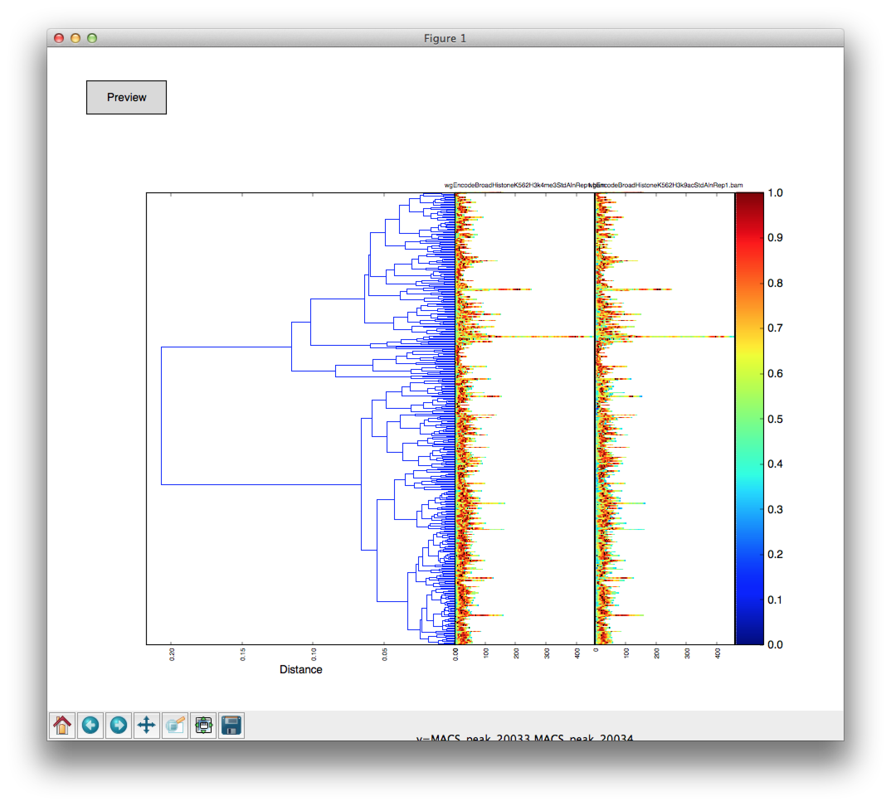
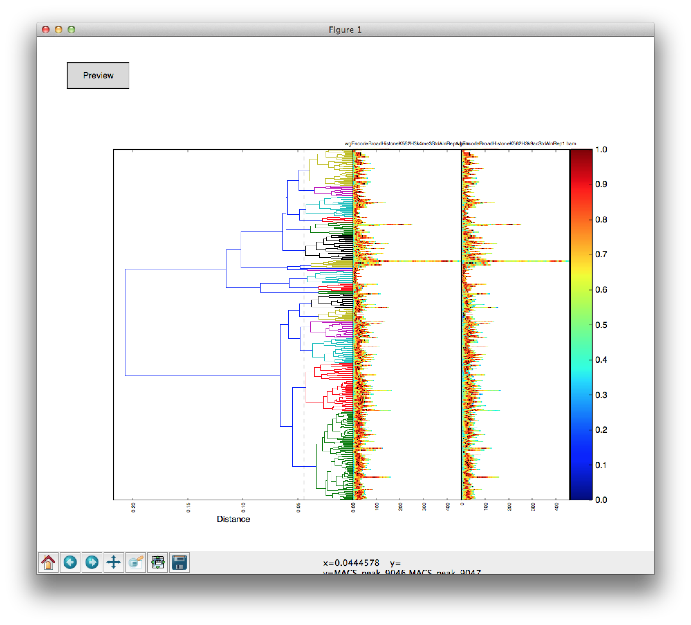
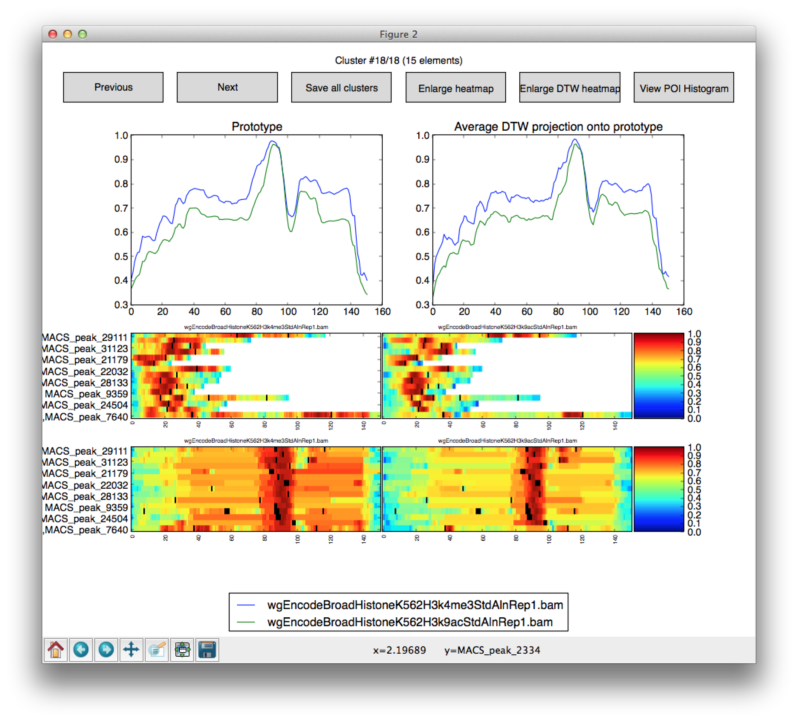
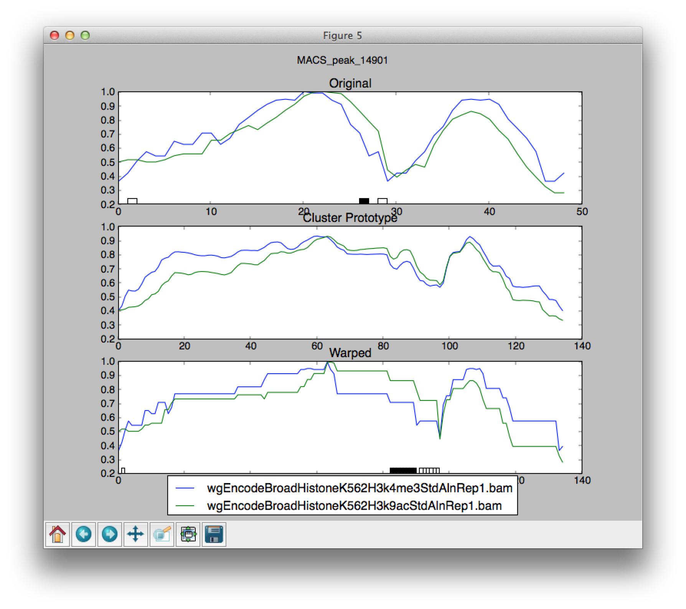
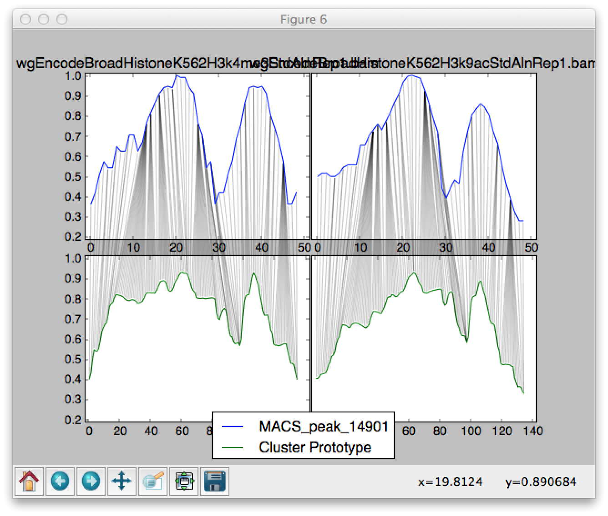

DGW: Dynamic Genome Warping
===============================

Dynamic Genome Warping (DGW) is  an open source clustering and alignment tool for epigenomic marks.
DGW Utilises Dynamic Time Warping distance to adaptively rescale the matching genomic marks to capture similarities
based on their shapes.

DGW is written in Python and needs Python 2.7 to run.
You can check the version of python you are running by doing `python -V` in your terminal.
If you do not have Python installed, or your python is not 2.7, please install it.
See section below how to do this if you do not have root access in the system.

Dependencies
-------------------------------
DGW depends on a fair share of popular open source packages:

- `numpy` - used for standard numerical tasks,
- `scipy` - used for for its cluster.hierarchy module
- `fastcluster` - used for for an efficient implementation of some of the functions of that very same module.
- `pandas` - used for for efficient data storage and processing containers
- `matplotlib` - used for for visualisation, optional dependancy
- `pysam` - used for for SAM file processing

The package also uses a modified version of `mlpy`s DTW package (distributed together with the package).

Installation
===============================
Stable installers of DGW are distributed over PyPi: https://pypi.python.org/pypi/dgw
In most cases, python package installers such as ``easy_install`` or ``pip`` should be able to install all dependancies,
however, since some of DGW's sources depend on the ``numpy`` headers, this dependancy must be satisfied before the installation.
This can be achieved by installing it either using PyPi distribution::

    pip install numpy

or by using the system's package manager such as ``MacPorts`` (Mac OS X).
After this initial step, the DGW installation can proceed as usual::

    pip install dgw

Note that some distributions have  problems installing ``scipy`` package through pip. If the installation fails at the ``scipy`` installation step
please install scipy through your system's package manager and proceed to run the installation again.

If you intend to run the DGW explorer application please also install ``matplotlib``, this package is included
as an optional requirement as the ``dgw-worker`` code (that is intended to run on a supercomputer) does not need it.
Matplotlib can also be installed using ``pip``::

    pip install matplotlib

If any of these fail because your user cannot write to the system's python site-packages directory, please consult
`Installing Python 2.7 without root access`_ guide below

Troubleshooting
-------------------------------

``dgw-explorer`` fails to run with the following ``pkg_resources.DistributionNotFound: matplotlib>=1.1.0``
~~~~~~~~~~~~~~~~~~~~~~~~~~~~~~~~~~~~~~~~~~~~~~~~~~~~~
The DistributionNotFound error occurs when the system cannot find ``matplotlib`` package in the current installation.
``matplotlib`` is a dependency to DGW that is required for visualisation, since DGW-worker can be run without any visualisation modules,
it is not installed during the initial install step as other dependencies, therefore it needs to be installed manually::

   pip install matplotlib

Matplotlib installation fails with ``src/ft2font.h:16:22: fatal error: ft2build.h: No such file or directory``
~~~~~~~~~~~~~~~~~~~~~~~~~~~~~~~~~~~~~~~~~~~~~~~~~~~~~~~~~~~
If you are receiving the above error when installing matplotlib, your system most likely lacks appropriate development packages
that are required to compile matplotlib package. Please consult http://matplotlib.org/users/installing.html#build-requirements
on how to install them and restart matplotlib afterwards.

On ubuntu, this could be achieved by::

    sudo apt-get build-dep python-matplotlib

Platform-specific instructions
-------------------------------
Ubuntu
~~~~~~~~~~~~~~~~~~~~~~~~~~~~~~
Note that some packages, e.g. `scipy` depend on dev versions of some of the GNU libraries.
You will likely to have to install them before proceeding, for instance, on ubuntu you will need to perform::

    apt-get install libblas-dev liblapack-dev gfortran

Mac OS X
~~~~~~~~~~~~~~~~~~~~~~~~~~~~~~
If your system is running Mac OS X, MacPorts can be used to install the majority of these dependencies::

    port install python27 py27-numpy py27-scipy py27-pandas py27-matplotlib py27-pysam

The remaining packages can then be installed with `pip` ::

    pip install fastcluster


.. _MacPorts = https://www.macports.org/

Windows
~~~~~~~~~~~~~~~~~~~~~~~~~~~~
It is probably easiest to install `numpy`, `scipy`, `pandas` and `matplotlib` on Windows via Enthought python distribution. This distribution is free for academic use. See
http://www.enthought.com/products/epd.php for instructions how to download and install it.

Unfortunately EPD 7.3 ships with an outdated version of `pandas` package that is not compatible with DGW, therefore you would have to upgrade it using pip in order to run it.
```
pip install --upgrade pandas
```

Packages that are not in EPD also need to be installed using pip
```
pip install pysam fastcluster
```

if `fastcluster` install fails install it from source from http://github.com/sauliusl/fastcluster

Don't forget MLPY:
```
pip install -e git://github.com/sauliusl/mlpy.git#egg=mlpy
```

Installing Python 2.7 without root access
~~~~~~~~~~~~~~~~~~~~~~~~~~~~~~~~~~~~~~~~~~~~~~~
The above steps assume you have Python 2.7 installed in your system.
Python 2.7 is a strict dependancy for DGW and is needed to be run any code.
We understand, however, that in some setups you may not have root access to the system and therefore will not be able
to install Python 2.7 to the system the usual way. Luckily, python can be installed to a local directory and easily be used
via the help of `virtualenv <http://www.virtualenv.org/en/latest/>`_. This section provides a guide on how this can be done.

In order to make a rather convoluted process easier, the author's have created a script that would handle everything for you.
This script is available as a Gist at https://gist.github.com/sauliusl/5735144 .
In order to use it, first download it by::

    wget https://gist.github.com/sauliusl/5735144/raw/install_python.sh

Make sure the script is executable::

   chmod +x install_python.sh

Now the script can be ran, the usage is either without any parameters::

   ./install_python.sh

What would install the python under your home directory, namely into directories ``~/lib/``, ``~/bin/``, and ``~/Include/``,
representing the ``/lib``, ``/bin`` and ``/Include`` directories under the main filesystem.
Alternatively, a positional argument can be provided to the script, e.g.::

   ./install_python.sh /some/installation/directory/

Which would install python 2.7 inside the ``/some/installation/directory/` directory.
It is entirely up to you where it is installed as long as your user has a read and write access to it.

Once the python was installed, you will find an ``activate.sh`` script under either the home or the specified directories.
Source this script in order to use the newly-installed python2.7::

   source activate.sh

At this point you should see ``which python`` point to the new python.

We also recommend creating a new virtual environment for python before installing DGW.
This can be done by first creating it, using::

   mkvirtualenv dgw

After the setup stages are finished you will see ``dgw`` prepended to your bash shell.
Type ``deactivate`` to leave your virtual environment at any point or ``workon dgw`` to go back to it.
See http://virtualenvwrapper.readthedocs.org/en/latest/ for the documentation on how to use virtualenv with Doug Hellmann's wrapper.

Once you are in correct virtualenv, please follow the `Installation`_ guide as normal.

Installation from source
~~~~~~~~~~~~~~~~~~~~~~~~~~
If you want to get the latest version of DGW, obtain the latest source by cloning the repository::

    git clone git://github.com/sauliusl/dgw.git

Install numpy to your python location, either by doing::

    pip install numpy

or by other means.

Navigate to the newly created `dgw` directory and run the following::

    pip install -e .

Alternatively, you can just run::

    python setup.py install

As in the `Installing Python 2.7 without root access`_ we strongly recommend installing the DGW into a virtual environment.

Usage
=======================

DGW is split into two parts - computationally demanding part, `dgw-worker` and an exploratory part - `dgw-explorer`.

`dgw-worker`
-----------------------

The worker part of the module is responsible for the actual hard work done in clustering the data.
It preprocesses the data, computes intermediate representations, calculates DTW distances between the data,
 performs hierarchical clustering and calculates prototypes of the clusters.

Sample usage
~~~~~~~~~~~~~~~~

Typically, `dgw-worker` would be run as follows:
```
dgw-worker.py -r regions.bed  -d dataset1.bam dataset2.bam --prefix dgw_example
```

In this case we are providing a bed file of regions of interest we want to cluster (`-r regions.bed`),
two datasets to work on (`-d dataset1.bam dataset2.bam`) and setting the prefix of files that will be output to `dgw_example`.

.. attention::
  Even though you need to provide only `.bam` files, the code silently assumes that index files are present under
  the extension `.bam.bai` and will fail to work if you do not have them in the same directory.

The DGW-worker will take all alignments from both datasets at regions in the `regions.bed`.
These alignments will then be extended and put into bins of 50 base pairs wide (use `-res` parameter to change this).
Then the unexpressed regions that have no bin with more than 10 reads in it (`-min-pileup` constraint to change) will be ignored.
Note that these ignored regions are then saved to `{prefix}_filtered_regions.bed` file.
The remaining data will be normalised by adding two artificial reads for each bin and then taking the log of the number of reads in the bins.
The remaining regions will then be clustered hierarchically using DTW distance with default parameters.

Output
~~~~~~~~~~~~~~~~~~~~~~
The worker will output 8 files to the working directory where `{prefix}` is the prefix specified by `--prefix` argument.

* `{prefix}_config.dgw` -- The main file storing the configuration of DGW that was used to produce the other files.
* `{prefix}_dataset.pd` -- Processed dataset after the normalisation. This can then be passed in a subsequent DGW session as `--processed-dataset` parameter.
* `{prefix}_filtered_regions.bed` -- Regions that were filtered out of the original regions set due to preprocessing constraints.
* `{prefix}_linkage.npy` -- Precomputed linkage matrix that is used in hierarchical clustering
* `{prefix}_missing_regions.bed` -- regions that were in the BED file provided as an input, but were not in one of the BAM files.
* `{prefix}_prototypes.pickle` -- computed prototypes of the clusters
* `{prefix}_regions.pd` -- regions that were processed, saved in DGW-readable format
* `{prefix}_warping_paths.pickle` -- computed warping paths of the original data projected onto prototypes

Points of interest
~~~~~~~~~~~~~~~~~~~~~
In some cases one would want to track some points of interest and their locations after warping,
for instance, we might want to see where transcription start sites are mapped to after the warping.
To do this, `dgw-worker` need to be run with a `-poi` parameter specified, for instance::

    dgw-worker.py -r regions.bed -poi poi.bed  -d dataset1.bam dataset2.bam --prefix dgw_example

The regions in `poi.bed` must have the same names as the regions in `tss_regions.bed` otherwise DGW won't be able to match them.
Also have a look at `--ignore-poi-non-overlaps` id some of the regions in the input file may not contain some of the regions listed as points of interest.
Similarly, `--ignore-no-poi-regions` will make DGW ignore those regions in input file that do not contain any of the points of interest provided.

Runtime
-----------------
Please note that DGW Worker is a very computationally-demanding piece of software.
It is designed to be used on a performant computer with as much CPU cores as possible.

A good way to estimate how long will the computation take on your machine is to use `--random-sample` parameter, e.g. pass `--random-sample 1000`.
This parameter will take only a random sample of N regions, where N is the provided number (in this case 1000).
The DGW worker will work on this random sample and report you both the time it took to compute the pairwise distances
on the random sample, and the estimated time to compute them on the full sample.

Prototype estimation and DTW projections onto prototypes will take around an extra 50% of time taken for pairwise distance calculations.

`dgw-explorer.py`
----------------------

A second major part of DGW is the DGW explorer.
This software is much less computationally demanding than DGW Worker and is designed to allow you to explore the results.

In order to use it start it by passing a `{prefix}_config.dgw` file computed by
DGW worker:
``dgw-explorer.py dgw_config.dgw``

The remaining files output by DGW explorer must be in the same directory as the `dgw_config.dgw` file, otherwise the explorer will not be able to locate them.

Upon successful start, a window showing the dendrogram and heatmap will pop up. Left click on the dendrogram to cut it at the desired place, wait for the plot to refresh and click preview to bring up a cluster explorer.

The cluster explorer allows you to cycle through clusters generated by the dendrogram cut and save both the data of the clusters and the generated heatmaps.

Note that you can also provide `-poi` parameter to `dgw-explorer.py`.
This will override the points of interest specified by worker.
DGW Explorer allows you to specify up to two sets of points of interest (just add the -poi parameter twice).

Please see the quickstart guide below in order for visual walkthrough on how to use DGW-explorer.

Utility modules
---------------
DGW comes with a few utility modules to help in experiments.

`dgw-extract-gene-regions`
~~~~~~~~~~~~~~~~~~~~~~~~~~
One of these modules is `dgw-extract-gene-regions`. As the name suggests it allows extraction of regions related to
genes. Currently it supports only knownGene files downloaded from ENCODE_.

To obtain these files, navigate to `table browser`_, make sure group `Genes and Gene Prediction Tracks` is selected,
track is set to `UCSC Genes` and the table set to `knownGenes`.

Click `Get output` to get the data and save it to file.

This file can then be processed using `dgw-extract-gene-regions`.


This utility takes two filenames, one for input file, other for the output file and one of the three options
as input parameters:

   - `--gene` - return regions spanning the length of whole gene
   - `--exon N` - return Nth exon (numbering is zero-based, so 0 is first exon).
   - `--splicing-site N` -- return Nth splicing sites (again 0 based).
   - `--tss` -- return transcription start sites of the genes only.

The last two options, `--splicing-site N` and `--tss` take an optional parameter `--window WINDOW_SIZE` that allows the user
to get the window of `WINDOW_SIZE` base pairs around the data.

For instance, if we wanted to get regions with 2000 bp around the transcription sites of all known genes::

    dgw-extract-gene-regions --tss --window 2000 knownGenes regions_around_tss.bed

The resulting regions will be saved to `regions_around_tss.bed`.

If one wants just the locations of TSS, i.e. for visualising in dgw-explorer, specify a window size of zero: `--window 0`.


.. _ENCODE: http://encodeproject.org/ENCODE/
.. _table browser: http://encodeproject.org/cgi-bin/hgTables?hgsid=330609261&clade=mammal&org=Human&db=hg19&hgta_group=genes&hgta_track=wgEncodeRegTxn&hgta_table=0&hgta_regionType=genome&position=chrX%3A151073054-151383976&hgta_outputType=wigData&hgta_outFileName=

`dgw-overlaps2poi`
~~~~~~~~~~~~~~~~~~~~
DGW also comes with an utility to ease the generation of POI files.
This utility, `dgw-overlaps2poi` takes two bed files for input:

- `main_regions_of_interest.bed`, the file that contains
the regions that will be processed by DGW-Worker (i.e. peak caller results)
- `poi_regions.bed`, bed file containing a list of points of interest, e.g. locations of transcription start sites
generated by dgw-extract-gene-regions.

The utility will then process all the regions in `main_regions_of_interest.bed` find all the regions in `poi_regions.bed`
that overlap *completely* (i.e. *all* points in the points of interest region are contained within the main region)
and spit out a DGW-readable POI file to standard output (which then can be redirected to file).

Example usage::

    dgw-overlaps2poi macs_results.bed tss_regions.bed > tss.poi

`dgw-prototypes2dot`
~~~~~~~~~~~~~~~~~~~~~
This tool is a helper tool around `dgw-explorer` that helps to visualise and debug the prototype generation out of
the DGW result config. After running it will generate a set of images, corresponding to original data and created prototypes
and a dot file, that can then be converted to other formats using GraphViz_.

Please consult::

   dgw-prototypes2dot --help

for more information.

.. WARNING::
   This function will generate png images for every single node in the dendrogram, including the leaves (actual data).
   This means that might take a fair amount of time to run and generate gigabytes of data, therefore it is not recommended
   to run it for anything but small datasets in order to understand how prototype generation works.

.. _GraphViz: http://www.graphviz.org/

Quickstart
=======================
This section will walk you though some example usage of DGW in full so you can have running start with the software.

In this section we are going to use `MACS peak caller`_ to get all peaks in the K562 H3k4me3 dataset from ENCODE `wgEncodeBroadHistone accession`_,
cluster them and visualise all transcription start sites and first splicing sites.


Preparation
-----------------------
Assuming you already have DGW installed, download the required datasets from ENCODE using i.e. wget::

    wget http://hgdownload.cse.ucsc.edu/goldenPath/hg19/encodeDCC/wgEncodeBroadHistone/wgEncodeBroadHistoneK562H3k4me3StdAlnRep1.bam http://hgdownload.cse.ucsc.edu/goldenPath/hg19/encodeDCC/wgEncodeBroadHistone/wgEncodeBroadHistoneK562H3k4me3StdAlnRep1.bam.bai
    wget http://hgdownload.cse.ucsc.edu/goldenPath/hg19/encodeDCC/wgEncodeBroadHistone/wgEncodeBroadHistoneK562H3k9acStdAlnRep1.bam http://hgdownload.cse.ucsc.edu/goldenPath/hg19/encodeDCC/wgEncodeBroadHistone/wgEncodeBroadHistoneK562H3k9acStdAlnRep1.bam.bai

You will also need control dataset to run MACS:

    wget http://hgdownload.cse.ucsc.edu/goldenPath/hg19/encodeDCC/wgEncodeBroadHistone/wgEncodeBroadHistoneK562ControlStdAlnRep1.bam http://hgdownload.cse.ucsc.edu/goldenPath/hg19/encodeDCC/wgEncodeBroadHistone/wgEncodeBroadHistoneK562ControlStdAlnRep1.bam.bai

Make sure to download the `bam.bai` files as they are also required and highly important.

Depending on your internet connection, this will take a short while. Let's set up other dependencies while we wait.
Install `MACS peak caller`_, if you haven't done so yet using the instructions on their site http://liulab.dfci.harvard.edu/MACS/.

Download `knownGenes` file from `ENCODE table browser`_.
Make sure group `Genes and Gene Prediction Tracks` is selected, track is set to `UCSC Genes` and the table set to `knownGenes`.
Save that file to the same directory the bam files are downloaded at, name it knownGenes.

Extracting transcription start sites and first splicing sites
~~~~~~~~~~~~~~~~~~~~~~~~~~~~~~~~~~~
Use `dgw-extract-gene-regions` to extract transcription start sites from this dataset::

    dgw-extract-gene-regions --tss knownGenes tss.bed

To extract first-splicing sites, do::

    dgw-extract-gene-regions --splicing-site 0 knownGenes fss.bed

Note that we are providing 0 as splicing site number, as these sites are numbered from 0.

Running MACS
~~~~~~~~~~~~~~~~~~~~~~~~~~~
At this point I assume that all datasets have been downloaded. If not, feel free to go have a cup of coffee until they do.

Run MACS peak caller on the dataset::

   macs14 -t wgEncodeBroadHistoneK562H3k4me3StdAlnRep1.bam -c wgEncodeBroadHistoneK562ControlStdAlnRep1.bam

Optional: Merge the peaks that are within 50 base pairs from each other, using bedtools_::

   bedtools merge -i NA_peaks.bed -d 50 -nms > macs_peaks.bed

If you do not want to do this, just rename `NA_peaks.bed` to `macs_peaks.bed`.

Getting POI mapped to the regions on maps
~~~~~~~~~~~~~~~~~~~~~~~~~~~~~~~~~~~~~~~~
At this point we want to create the POI datasets for visualising transcription start sites and first splicing sites
on MACS. In order to do this, we are going to use `dgw-overlaps2poi` utility::

   dgw-overlaps2poi macs_peaks.bed tss.bed > tss.poi

The previous command would take all the regions in `macs_peaks.bed`, find all the regions in previously created `tss.bed`
that are *fully contained* within the `macs_peaks.bed` and output them to stdout (which we are redirecting to `tss.poi`).
This might take a short while to run.

Similarly, we need to do this for first splicing sites::

   dgw-overlaps2poi macs_peaks.bed fss.bed > fss.poi

Running DGW-Worker
~~~~~~~~~~~~~~~~~~~~~~~~~~~~~~~
Congratulations, we have finally arrived to the interesting part of this quick start guide. Thanks for staying with me.
We are going to run DGW-Worker on our dataset. In order to make this quick-start efficient we are going to
provide `--random-sample 5000` parameter to DGW (and thus just work with a random sample of 1000 regions), but
feel free to try it out without this parameter later on to look for interesting patterns in the complete dataset.

We are going to run the following command::

   dgw-worker -r macs_peaks.bed -d wgEncodeBroadHistoneK562H3k4me3StdAlnRep1.bam wgEncodeBroadHistoneK562H3k9acStdAlnRep1.bam -poi fss.poi --ignore-no-poi-regions --metric sqeuclidean --random-sample 1000 --prefix dgw_quickstart -sb 12 --normalise-pileups
Let's dissect this:

- `-r macs_peaks.bed` -- Cluster the regions in `macs_peaks.bed`
- `-d wgEncodeBroadHistoneK562H3k4me3StdAlnRep1.bam wgEncodeBroadHistoneK562H3k9acStdAlnRep1.bam` -- Use only the data in these two datasets to cluster them
- `-poi fss.poi` -- Use regions in `fss.poi` as regions of interest
- `--ignore-no-poi-regions` -- Ignore all regions that do not have any entry in `fss.poi` (in this case, regions that do not contain a first splicing site).
- `--metric sqeuclidean` -- use Squared Euclidean as distance metric (can also be `euclidean`, or `cosine` if you feel like it).
- `--random-sample 1000` -- take only 1000 regions at random rather than full dataset (so it's faster).
- `--prefix dgw_quickstart` -- prefix the output files with `dgw_quickstart`.
- `-sb 12` -- use slanted band of size 12 to constrain the DTW distance.
- `-normalise-pileups` -- divide all the regions in the dataset from the maximum value within that region in order to make the value of the largest pipleup in the data consistently equal to 1.

Once you know what each parameter does, run the command. Due to randomness of `--random-sample` parameter,
each run of DGW will produce different results. The sample output that I got is shown here with some commentary::

    > Reading regions from 'macs_peaks.bed' ....
    > 30827 regions of interest read
    > Using only a random sample of 1000 regions from 'macs_peaks.bed'
    > 1000 regions remain

30827 regions of interest were provided using `-r` parameter.
Out of those regions, a random sample of 1000 was selected.
::

    > Reading points of interest
    > Reading dataset ...
    > 575 regions were removed as they have no POI data with them and --ignore-no-poi-regions was set
    > Saving them to 'dgw_quickstart_no_poi_regions.bed'

Then POI regions were read, and 575 regions out of the previously selected regions were removed as they
had no POI data associated with them (no first splicing sites contained them) and --ignore-no-poi-regions was set. These
regions are saved to :file:`dgw_quickstart_no_poi_regions.bed`.
::

    > 61 regions were filtered out from dataset due to --min-pileup constraint, they were saved to dgw_quickstart_filtered_regions.bed

Then 61 regions were filtered out from dataset due to `--min-pileup` constraint. This constraint pre-filters regions
to leave only regions that have a bin with more than 10 reads falling into it by default, in order to not waste
the computational resources for areas that are not so interesting.

::

    > 364 regions remaining and will be processed
    > Serialising regions to dgw_quickstart_regions.pd
    > Saving dataset to dgw_quickstart_dataset.pd

After the preprocessing 364 regions remained to be processed.
Regions were serialised to :file:`dgw_quickstart_regions.pd` for quick reading by dgw-explorer.
Dataset was serialised to :file:`dgw_quickstart_dataset.pd`. You can run subsequent tests on the same dataset
by providing it as a `--pd dgw_quickstart.pd`.

::

    > Calculating pairwise distances (this might take a while) ...
    > Using all available cpu cores (8)
    > Pairwise distances calculation took 3.077042 s
    > Expected calculation duration if random-sample was not used: 3119.20534722 s
    > Computing linkage matrix
    > Saving linkage matrix to 'dgw_quickstart_linkage.npy'
    > Computing prototypes
    > Saving prototypes to 'dgw_quickstart_prototypes.pickle'
    > Computing warping paths
    > Saving warping paths to 'dgw_quickstart_warping_paths.pickle'

8 processes cores were used for calculation of the DTW pairwise distances.
This calculation took a bit more than 3s for these 364 regions.
It would take a bit under an hour to do this for all regions without the `--random-sample`
The linkage was computed and saved to :file:`dgw_quickstart_linkage.npy`
Prototypes were generated and saved to :file:`dgw_quickstart_prototypes.pickle`.
Data was warped to the prototypes, and the warping paths saved to :file:`dgw_quickstart_warping_paths.pickle`.

::

    > Saving configuration to 'dgw_quickstart_config.dgw'
    > Done

The configuration was saved to `dgw_quickstart_config.dgw`. This is the file the DGW explorer will have to be called upon.

Exploring the results using `dgw-explorer`
~~~~~~~~~~~~~~~~~~~~~~~~~~~~~~~~~~~~~~~~~
We are finally reaching the culmination of this quick start guide. We will run dgw-explorer on the results of dgw-worker run.

Go ahead and type::

   dgw-explorer dgw_quickstart_config.dgw

You should see a window similar to the one below appear:



In this window, the dendrogram is shown alongside the heatmap of the clusters.

*Right click* anywhere on the dendrogram to cut it:



You can see how the line moves and the cluster colours change as you cut at different levels.

If you click on the preview button in top left, a cluster explorer window simmilar to the one below will show up.
Navigate the clusters using `Previous` and `Next` buttons:



This window consists of four panels.
In the top-left one, you can see the cluster prototype that was generated.
The top-right one shows the average DTW projection of the items in the cluster onto this prototype.

The two panels in the bottom show the heatmaps of both the original data (the top panel) and the projected data.
Each heatmap is split per dataset and labelled apropriately.

The black dots you see in the heatmaps are locations of POI points. In this example, they are first splicing sites
as ``dgw-worker`` was run using them as POI.

We can change that by closing all the ``dgw-explorer`` windows and running it with the POI parameter::

   dgw-explorer -poi tss.poi dgw_quickstart_config.dgw

This would make all the transcription start sites appear as black dots.

You can specify up to two kinds of Points of interest at the same time, e.g.::

   dgw-explorer -poi fss.poi tss.poi dgw_quickstart_config.dgw

Now POI in fss.poi will be marked in *black* (since they were listed first) and POI in tss.poi will be marked in *white*.
The remainder of the images will be constructed from DGW-explorer run with both sets of points highlighted.

In the cluster explorer window there are six buttons lined up.
You should have already used the first two, `Previous` and `Next`.

The third button, `Save all clusters` outputs the cluster data into the :file:`output/` directory of the main working directory
when clicked. It would output the prototypes, heatmaps and .bed files of the data in each cluster. Please look at your
console window to track the progress of this saving process, as it takes a short while to finish.

Buttons `Enlarge heatmap` and `Enlarge DTW heatmap` will open the heatmaps of original data or the warped data
in a new window.

The final button, `View POI histogram`, shows the histograms of the POI distribution over bins in the original
and in the warped data. The data points in original dataset are normalised to be of the length of the maximum data set
before the histogram is calculated.

The final feature of the DGW-explorer you need to know about is the warping previewer.
If you right-click any of the heatmaps of the cluster explorer window, two new windows showing the warping will pop up.
The two windows are pictured below:





The first one shows the original data item (top row), the cluster prototype (middle) and the DTW projection
of this item onto the cluster prototype. The points of interest are pictured as tiny rectangles in their original color.

The second window visualises the DTW warping that is being done while projecting the item on the prototype.
Each line corresponds to a DTW mapping between the points.

This is the end of this quickstart guide. At this point you should know enough to be able to use DGW at its best.
Please do not hesitate to contact the author if you have any enquiries, or issue a pull request on github_, if you think
you can improve this guide.

.. _MACS peak caller: http://liulab.dfci.harvard.edu/MACS/
.. _bedtools: http://bedtools.readthedocs.org/en/latest/
.. _wgEncodeBroadHistone accession: http://hgdownload.cse.ucsc.edu/goldenPath/hg19/encodeDCC/wgEncodeBroadHistone/
.. _ENCODE table browser: http://encodeproject.org/cgi-bin/hgTables?hgsid=330609261&clade=mammal&org=Human&db=hg19&hgta_group=genes&hgta_track=wgEncodeRegTxn&hgta_table=0&hgta_regionType=genome&position=chrX%3A151073054-151383976&hgta_outputType=wigData&hgta_outFileName=
.. _github: https://github.com/sauliusl/dgw

Misc
-------------------------------

Dealing with broadPeak files
~~~~~~~~~~~~~~~~~~~~~~~~~~~~~
DGW requires the BED files to contain unique identifiers in the name column (column four).
Most broadPeak files available in ENCODE have an empty name column, (indicated by a dot).
In this case, these files will not work with DGW.

This issue can be resolved easily with the help of Unix ``awk`` command::

    awk -F '\t' '{$4 = $1 ":" $2 "-" $3} {print}' data.broadPeak > data.bed

would create a unique identifier for each of the rows in the ``data.broadPeak`` file and write them into ``data.bed``.
The new ``data.bed`` can then be passed to DGW as input file.
